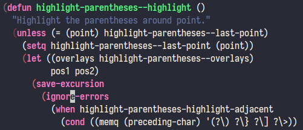

# highlight-parentheses.el: Highlights parentheses surrounding point in Emacs

## Usage

Add the following to your `.emacs` file:

```elisp
(require 'highlight-parentheses)
```

Enable the mode using <kbd>M-x highlight-parentheses-mode</kbd> or by adding it
to a hook like so:

```elisp
(add-hook 'prog-mode-hook #'highlight-parentheses-mode)
```

## Screenshot


